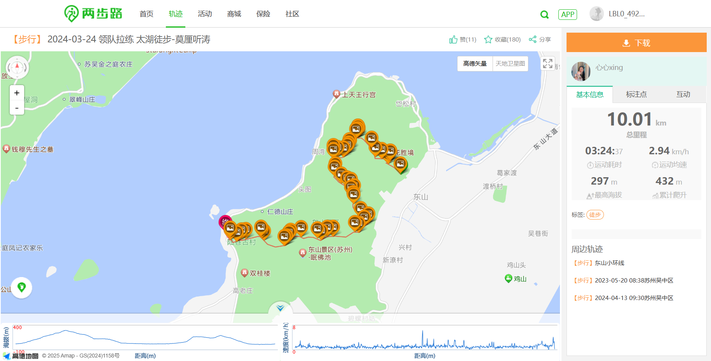
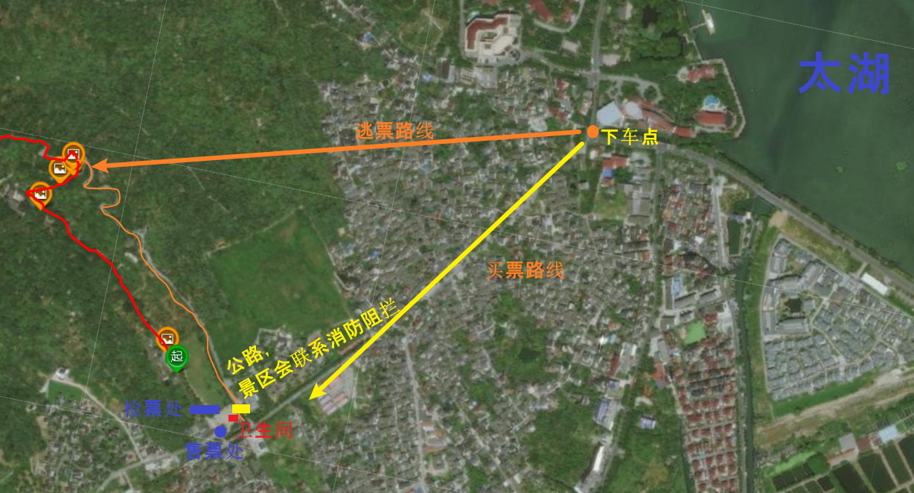

# 莫厘听涛 路书

## 📍 基本信息
- **线路名称**：莫厘听涛
- **类型**：穿越线
- **难度**：⭐⭐☆（2.5星）
- **长度**：10KM
- **累计爬升**：430M（280M+150M）

---

## 🎫 门票信息
- 起点雨花胜景团票：15元/人（可通过其他路线绕开）
- 终点陆港古镇门票：65元/人（从莫厘峰经24弯进入无需门票，再次进入需购买）

---

## 📌 线路情况

**整体路线：**
前半程以台阶、公路为主，后半程为野路。沿途穿越茶园、村庄、枇杷园，路线多岔路，有一定复杂度，途中可多次远眺中国第三大淡水湖——太湖。

**轨迹文件：** [📥 点击下载 莫厘听涛.kml](https://raw.githubusercontent.com/yy-tayu/trailbook/main/routes/molitingtao/kml/莫厘听涛.kml)

---

## 🚗 停车与下客情况
- **大巴下客点** 距离徒步起点约600m，起点附近大巴停车困难，建议大巴下客后步行。
- **终点大巴停车** 均为路两旁停车，无固定停车场，大巴需自行寻找距离终点较近的停车点。
- **自驾停车场** 在轨迹起点附近适合轿车停车。

---

## 🚻 厕所及补给
- 轨迹起点处有厕所。
- 莫厘峰也设有厕所。
- 莫厘峰提供面食、自动贩卖机提供补给（水）。

---

## 🕑 时间规划（仅供参考）
- 10:30 大巴下车点集合出发
- 12:00 左右到达莫厘峰，进行午餐休息
- 15:00 到达陆港古镇
- 15:30 返回大巴点准备返程

---

## 🎒 装备建议
- 登山杖、徒步鞋、防晒用品、零食、防雨装备
- 夏季徒步建议每人至少携带3瓶水，其中包含至少一瓶电解质水。

---

## 🍽️ 推荐美食
- 莫厘峰顶提供面食补给
- 陆港古镇内商贩提供当地特色小吃和饮品（推荐品尝枇杷季当地新鲜枇杷）

---

## 🌸 观赏时间
- 映山红花期：清明节前后（3月底至4月初）
- 枇杷成熟期：5月底至6月初

---

## ⚠️ 注意事项
- 起点团体进入雨花胜景需购票，建议从村落穿过避免进入景区。
- 莫厘峰手机信号较弱。
- 下山路段有野路和茶园，岔路多、路况复杂，注意安全。
- 路过映山红时，请勿折枝，注意保护环境。
- 经过琵琶林时严禁采摘，枇杷为当地农户经济作物，请尊重农户劳动成果。
- 陆港古镇按轨迹属于逃票路线，从其他位置进入需要购票，再次进入需购票。
- 自驾需规划返回起点取车的环线或打车返回起点停车场。
- 上海市区或临港出发均无需在服务区停靠，返程节假日建议绕行嘉善或小昆山服务区。

---

🚩 **欢迎参与反馈和更新，共同维护更优质的路书！**
